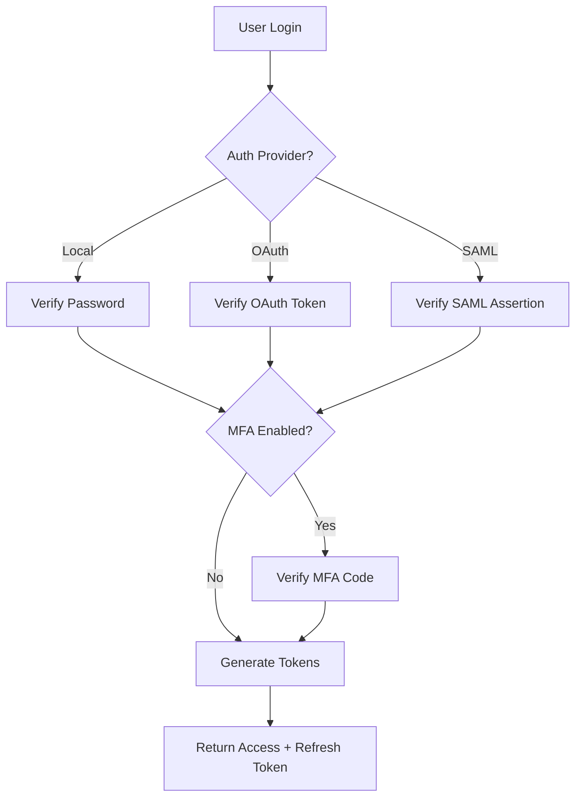

# ChargeCars V2 - Authentication & Authorization Design
**Created**: June 3, 2025  
**Status**: Proposed Design  
**Impact**: High - System-wide security architecture

---

## 🎯 **OVERVIEW**

### Authentication vs Authorization:
- **Authentication**: Who are you? (Identity verification)
- **Authorization**: What can you do? (Permission management)

### Design Principles:
1. **Role-Based Access Control (RBAC)**: Users get permissions through roles
2. **Organization Scoped**: Permissions are scoped to organizations
3. **Hierarchical**: Some roles inherit permissions from others
4. **Flexible**: Can assign multiple roles per user
5. **Auditable**: All permission checks are logged

---

## 👥 **USER ROLE HIERARCHY**

### 1. **System-Level Roles** (Cross-Organization)
```
SUPER_ADMIN
├── SYSTEM_ADMIN
│   ├── BUSINESS_ENTITY_ADMIN
│   └── INTEGRATION_ADMIN
└── AUDIT_VIEWER
```

### 2. **Organization-Level Roles**
```
ORGANIZATION_OWNER
├── ORGANIZATION_ADMIN
│   ├── FINANCE_MANAGER
│   ├── OPERATIONS_MANAGER
│   ├── SALES_MANAGER
│   └── SUPPORT_MANAGER
├── STANDARD_USER
│   ├── SALES_REP
│   ├── INSTALLER
│   ├── SUPPORT_AGENT
│   └── ACCOUNTANT
└── LIMITED_USER
    ├── CUSTOMER_USER
    └── EXTERNAL_VIEWER
```

### 3. **Special Roles**
```
DEALER_ADMIN       - Special permissions for dealer organizations
PARTNER_USER       - Limited partner access
BILLING_CONTACT    - Financial approval permissions
API_USER           - System integration access
GUEST              - Very limited, temporary access
```

---

## 📊 **ROLE DEFINITIONS**

### System Roles:

#### **SUPER_ADMIN**
- Full system access across all business entities
- Can impersonate other users
- Access to all data and configurations
- *Use case*: ChargeCars IT administrators

#### **SYSTEM_ADMIN**
- Manage users, roles, and permissions
- Configure system settings
- Cannot access financial data across entities
- *Use case*: System maintenance staff

#### **BUSINESS_ENTITY_ADMIN**
- Full access within assigned business entities
- Cannot cross entity boundaries
- *Use case*: LaderThuis.nl administrator

### Organization Roles:

#### **ORGANIZATION_OWNER**
- Full control over their organization
- Can manage users within organization
- Access to all organization data
- *Use case*: Company owner/CEO

#### **ORGANIZATION_ADMIN**
- Manage organization settings
- Add/remove users
- Cannot delete organization
- *Use case*: Office manager

#### **FINANCE_MANAGER**
- Approve quotes and invoices
- Access to financial reports
- Manage pricing agreements
- Set credit limits
- *Use case*: CFO, Finance director

#### **OPERATIONS_MANAGER**
- Manage work orders and installations
- Assign teams and resources
- View operational dashboards
- *Use case*: Operations lead

#### **SALES_MANAGER**
- Manage quotes and orders
- Access to sales reports
- Override pricing (within limits)
- *Use case*: Sales team lead

#### **SUPPORT_MANAGER**
- Manage support tickets
- Access customer communication
- Escalate issues
- *Use case*: Customer service lead

### Standard User Roles:

#### **SALES_REP**
- Create and manage own quotes/orders
- View own customer data
- Limited pricing flexibility
- *Use case*: Sales personnel

#### **INSTALLER**
- View assigned work orders
- Update installation status
- Upload completion photos
- *Use case*: Field technicians

#### **SUPPORT_AGENT**
- Handle support tickets
- Access customer history
- Create internal tasks
- *Use case*: Help desk staff

#### **ACCOUNTANT**
- View financial data
- Generate reports
- Cannot approve transactions
- *Use case*: Bookkeeping staff

### Limited Roles:

#### **CUSTOMER_USER**
- View own orders
- Track installation status
- Submit support tickets
- *Use case*: End customers

#### **EXTERNAL_VIEWER**
- Read-only access to specific data
- Time-limited access
- *Use case*: Auditors, consultants

---

## 🔐 **PERMISSION MATRIX**

### Core Permissions:
```javascript
const PERMISSIONS = {
  // Orders
  'orders.view.own': 'View own orders',
  'orders.view.organization': 'View organization orders',
  'orders.view.all': 'View all orders',
  'orders.create': 'Create new orders',
  'orders.edit.own': 'Edit own orders',
  'orders.edit.all': 'Edit any order',
  'orders.delete': 'Delete orders',
  'orders.approve': 'Approve orders',
  
  // Quotes
  'quotes.view': 'View quotes',
  'quotes.create': 'Create quotes',
  'quotes.edit': 'Edit quotes',
  'quotes.approve': 'Approve quotes',
  'quotes.override_pricing': 'Override pricing',
  
  // Financial
  'financial.view_reports': 'View financial reports',
  'financial.approve_invoices': 'Approve invoices',
  'financial.manage_payments': 'Manage payments',
  'financial.set_credit_limits': 'Set credit limits',
  'financial.view_margins': 'View profit margins',
  
  // Users
  'users.view': 'View users',
  'users.create': 'Create users',
  'users.edit': 'Edit users',
  'users.delete': 'Delete users',
  'users.assign_roles': 'Assign roles',
  
  // System
  'system.manage_integrations': 'Manage integrations',
  'system.view_audit_logs': 'View audit logs',
  'system.manage_business_entities': 'Manage entities',
  'system.impersonate': 'Impersonate users'
};
```

---

## 🏗️ **DATABASE SCHEMA**

### New Table: user_account
```sql
CREATE TABLE user_account (
  id uuid PRIMARY KEY,
  contact_id uuid REFERENCES contact(id),
  
  -- Authentication
  email text UNIQUE NOT NULL,
  password_hash text,
  auth_provider enum('local', 'google', 'microsoft', 'saml'),
  external_auth_id text,
  
  -- Security
  mfa_enabled boolean DEFAULT false,
  mfa_secret text,
  last_login_at timestamp,
  last_login_ip inet,
  failed_login_attempts int DEFAULT 0,
  locked_until timestamp,
  
  -- Tokens
  refresh_token text,
  refresh_token_expires_at timestamp,
  password_reset_token text,
  password_reset_expires_at timestamp,
  
  -- Status
  is_active boolean DEFAULT true,
  email_verified boolean DEFAULT false,
  email_verification_token text,
  
  created_at timestamp DEFAULT NOW(),
  updated_at timestamp DEFAULT NOW()
);
```

### New Table: role
```sql
CREATE TABLE role (
  id uuid PRIMARY KEY,
  role_code text UNIQUE NOT NULL,
  role_name text NOT NULL,
  description text,
  
  -- Scope
  scope_type enum('system', 'organization', 'special'),
  
  -- Permissions
  permissions text[], -- Array of permission codes
  
  -- Hierarchy
  parent_role_id uuid REFERENCES role(id),
  
  is_active boolean DEFAULT true,
  created_at timestamp DEFAULT NOW()
);
```

### New Table: user_role
```sql
CREATE TABLE user_role (
  id uuid PRIMARY KEY,
  user_account_id uuid REFERENCES user_account(id),
  role_id uuid REFERENCES role(id),
  
  -- Scope
  organization_id uuid REFERENCES organization(id),
  business_entity_id uuid REFERENCES business_entity(id),
  
  -- Validity
  granted_by_user_id uuid REFERENCES user_account(id),
  granted_at timestamp DEFAULT NOW(),
  expires_at timestamp,
  
  is_active boolean DEFAULT true,
  
  UNIQUE(user_account_id, role_id, organization_id, business_entity_id)
);
```

### New Table: api_token
```sql
CREATE TABLE api_token (
  id uuid PRIMARY KEY,
  user_account_id uuid REFERENCES user_account(id),
  
  -- Token details
  token_hash text UNIQUE NOT NULL,
  token_name text NOT NULL,
  token_type enum('personal', 'integration', 'webhook'),
  
  -- Permissions
  scopes text[], -- Limited scopes for this token
  
  -- Restrictions
  allowed_ips inet[],
  rate_limit_per_hour int,
  
  -- Usage
  last_used_at timestamp,
  usage_count int DEFAULT 0,
  
  -- Validity
  expires_at timestamp,
  is_active boolean DEFAULT true,
  
  created_at timestamp DEFAULT NOW()
);
```

---

## 🔄 **AUTHENTICATION FLOW**

### 1. **Login Flow**


### 2. **Token Structure (JWT)**
```json
{
  "sub": "user_account_id",
  "email": "user@example.com",
  "roles": [
    {
      "role": "SALES_MANAGER",
      "organization_id": "org_uuid",
      "business_entity_id": "entity_uuid"
    }
  ],
  "permissions": ["orders.create", "quotes.approve"],
  "exp": 1234567890,
  "iat": 1234567890
}
```

---

## 🛡️ **AUTHORIZATION PATTERNS**

### 1. **Permission Check Function**
```javascript
function hasPermission(user, permission, context = {}) {
  // 1. Super admin bypass
  if (user.roles.includes('SUPER_ADMIN')) return true;
  
  // 2. Check direct permissions
  if (user.permissions.includes(permission)) {
    // 3. Check context (organization, entity)
    return checkContext(user, context);
  }
  
  // 4. Check role-based permissions
  for (const role of user.roles) {
    if (rolePermissions[role].includes(permission)) {
      return checkContext(user, context);
    }
  }
  
  return false;
}
```

### 2. **Resource-Level Checks**
```javascript
function canAccessOrder(user, order) {
  // Owner check
  if (order.created_by_user_id === user.id) {
    return hasPermission(user, 'orders.view.own');
  }
  
  // Organization check
  if (user.organization_id === order.customer_organization_id) {
    return hasPermission(user, 'orders.view.organization');
  }
  
  // Related organization check
  if (order.related_organizations.includes(user.organization_id)) {
    return checkOrderAccessControl(user, order);
  }
  
  // Global permission
  return hasPermission(user, 'orders.view.all');
}
```

---

## 🚀 **IMPLEMENTATION RECOMMENDATIONS**

### 1. **Start Simple**
Begin with these core roles:
- `ADMIN` - Full organization access
- `MANAGER` - Approve and manage
- `USER` - Standard operations
- `VIEWER` - Read-only access

### 2. **Token Strategy**
- Access Token: 15 minutes (short-lived)
- Refresh Token: 7 days (rotate on use)
- API Token: No expiry (revokable)

### 3. **Security Best Practices**
- Hash all tokens before storage
- Log all authentication events
- Implement rate limiting
- Use secure cookie flags
- Enforce strong passwords
- Support MFA from day one

### 4. **Migration Path**
1. Map existing `access_level` to new roles
2. Create user accounts for existing contacts
3. Assign default roles based on organization type
4. Gradually introduce more granular permissions

---

## 📋 **NEXT STEPS**

1. **Create Database Tables**
   - user_account
   - role
   - user_role
   - api_token

2. **Implement Auth Endpoints**
   - POST /auth/login
   - POST /auth/logout
   - POST /auth/refresh
   - POST /auth/verify

3. **Create Middleware**
   - Token validation
   - Permission checking
   - Rate limiting
   - Audit logging

4. **Build Admin UI**
   - User management
   - Role assignment
   - Permission viewer
   - Audit log viewer 