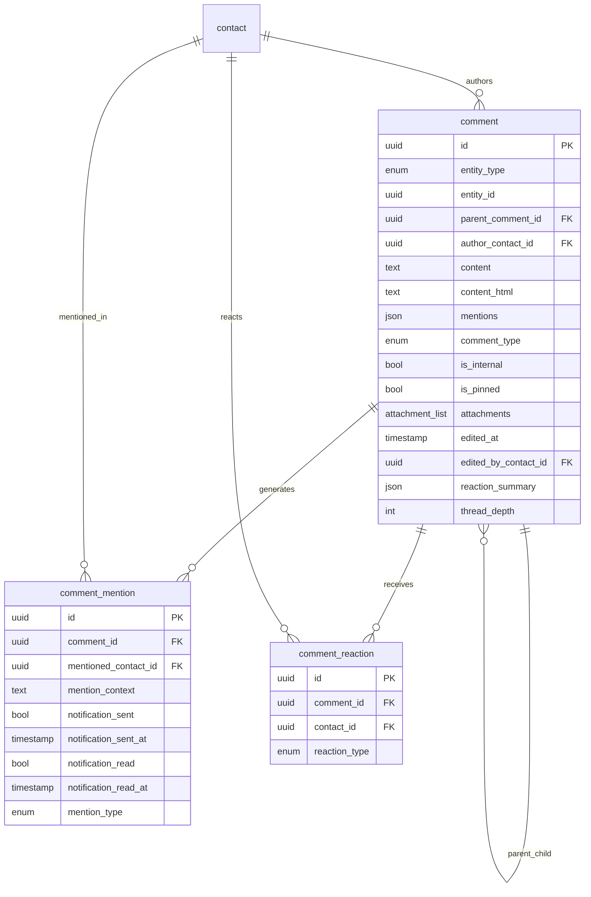

# Comments System Database Schema

**Last Updated**: 2025-06-15  
**Status**: Implemented in Xano  
**Table Count**: 3 tables (comment, comment_mention, comment_reaction)

## Overview

Universal comments system supporting internal team collaboration on all entity types with advanced features:
- Polymorphic entity references (order, quote, visit, etc.)
- @mention system with notifications
- Threading/replies with unlimited depth
- File attachments via Xano attachment fields
- Reaction system (likes, thumbs up, etc.)
- Edit tracking and audit trails

## Database Tables

### 1. comment (ID: 110)
**Purpose**: Core comments table for universal entity collaboration

| Field | Type | Constraints | Description |
|-------|------|-------------|-------------|
| `id` | uuid | PK, NOT NULL | Primary key UUID |
| `created_at` | timestamp | NOT NULL | Creation timestamp |
| `updated_at` | timestamp | NOT NULL | Last update timestamp |
| `display_name` | text | NULL | Audit trail display name |
| `entity_type` | enum | NOT NULL | Entity type (order, quote, visit, etc.) |
| `entity_id` | uuid | NOT NULL | Polymorphic entity reference |
| `parent_comment_id` | uuid | FK comment, NULL | Parent comment for threading |
| `author_contact_id` | uuid | FK contact, NOT NULL | Comment author |
| `content` | text | NOT NULL | Raw comment content with @mentions |
| `content_html` | text | NULL | Processed HTML content |
| `mentions` | json | NULL | Array of mentioned contact IDs |
| `comment_type` | enum | NOT NULL | Comment categorization |
| `is_internal` | bool | NOT NULL, DEFAULT true | Internal vs customer-facing |
| `is_pinned` | bool | NOT NULL, DEFAULT false | Pinned to top of discussion |
| `attachments` | attachment | LIST, NULL | File attachments |
| `edited_at` | timestamp | NULL | Last edit timestamp |
| `edited_by_contact_id` | uuid | FK contact, NULL | Who last edited |
| `reaction_summary` | json | NULL | Reaction counts summary |
| `thread_depth` | int | NOT NULL, DEFAULT 0 | Threading nesting level |

**Enums:**
- `entity_type`: order, quote, visit, line_item, work_order, invoice, payment, form_submission, internal_task, ticket
- `comment_type`: comment, mention, status_note, internal_note, system_notification, file_share

**Indexes:**
- Primary: `id`
- Query: `entity_type + entity_id + created_at`
- Author: `author_contact_id + created_at`
- Threading: `parent_comment_id`

### 2. comment_mention (ID: 111)
**Purpose**: Junction table tracking @mentions with notification status

| Field | Type | Constraints | Description |
|-------|------|-------------|-------------|
| `id` | uuid | PK, NOT NULL | Primary key UUID |
| `created_at` | timestamp | NOT NULL | Creation timestamp |
| `comment_id` | uuid | FK comment, NOT NULL | Source comment |
| `mentioned_contact_id` | uuid | FK contact, NOT NULL | Mentioned contact |
| `mention_context` | text | NULL | Context preview for notification |
| `notification_sent` | bool | NOT NULL, DEFAULT false | Notification delivery status |
| `notification_sent_at` | timestamp | NULL | When notification was sent |
| `notification_read` | bool | NOT NULL, DEFAULT false | Read receipt status |
| `notification_read_at` | timestamp | NULL | When marked as read |
| `mention_type` | enum | NOT NULL | Type of mention |

**Enums:**
- `mention_type`: direct_mention, team_mention, role_mention

**Indexes:**
- Primary: `id`
- Mentions: `mentioned_contact_id + notification_read`
- Comments: `comment_id`

### 3. comment_reaction (ID: 112)
**Purpose**: User reactions to comments (likes, thumbs up, etc.)

| Field | Type | Constraints | Description |
|-------|------|-------------|-------------|
| `id` | uuid | PK, NOT NULL | Primary key UUID |
| `created_at` | timestamp | NOT NULL | Creation timestamp |
| `comment_id` | uuid | FK comment, NOT NULL | Target comment |
| `contact_id` | uuid | FK contact, NOT NULL | User who reacted |
| `reaction_type` | enum | NOT NULL | Type of reaction |

**Enums:**
- `reaction_type`: like, thumbs_up, thumbs_down, heart, laugh, confused, eyes

**Indexes:**
- Primary: `id`
- Reactions: `comment_id + reaction_type`
- User reactions: `contact_id + comment_id` (unique constraint)

## Entity Relationships



## Polymorphic Entity Support

The comments system supports all ChargeCars entities:

| Entity Type | Table ID | Comments Use Case |
|-------------|----------|-------------------|
| `order` | 55 | Installation progress, customer updates |
| `quote` | 56 | Pricing discussions, approval notes |
| `visit` | 46 | Site survey reports, technical notes |
| `line_item` | 57 | Product specifications, availability |
| `work_order` | 60 | Task updates, completion status |
| `invoice` | 58 | Payment discussions, adjustments |
| `payment` | 59 | Transaction notes, issues |
| `form_submission` | 43 | Form processing, validation notes |
| `internal_task` | 61 | Task progress, assignments |
| `ticket` | 62 | Support discussions, resolution |

## Usage Patterns

### 1. Standard Comments
```sql
-- Get all comments for an order
SELECT c.*, contact.name as author_name 
FROM comment c 
JOIN contact ON c.author_contact_id = contact.id
WHERE c.entity_type = 'order' 
  AND c.entity_id = 'order_uuid'
ORDER BY c.created_at ASC;
```

### 2. Threaded Discussions
```sql
-- Get comment thread with replies
WITH RECURSIVE comment_thread AS (
  -- Root comments
  SELECT *, 0 as depth 
  FROM comment 
  WHERE entity_type = 'order' 
    AND entity_id = 'order_uuid' 
    AND parent_comment_id IS NULL
  
  UNION ALL
  
  -- Replies
  SELECT c.*, ct.depth + 1
  FROM comment c
  JOIN comment_thread ct ON c.parent_comment_id = ct.id
)
SELECT * FROM comment_thread ORDER BY depth, created_at;
```

### 3. Mention Notifications
```sql
-- Get unread mentions for user
SELECT cm.*, c.content, c.entity_type, c.entity_id
FROM comment_mention cm
JOIN comment c ON cm.comment_id = c.id
WHERE cm.mentioned_contact_id = 'user_uuid'
  AND cm.notification_read = false
ORDER BY cm.created_at DESC;
```

### 4. Reaction Summaries
```sql
-- Aggregate reactions per comment
SELECT 
  comment_id,
  reaction_type,
  COUNT(*) as count
FROM comment_reaction 
WHERE comment_id IN ('comment1', 'comment2', 'comment3')
GROUP BY comment_id, reaction_type;
```

## Performance Considerations

### 1. Indexing Strategy
- **Entity queries**: Compound index on `(entity_type, entity_id, created_at)`
- **Author queries**: Index on `(author_contact_id, created_at)`
- **Mention queries**: Index on `(mentioned_contact_id, notification_read)`
- **Threading**: Index on `parent_comment_id`

### 2. Pagination
- Use cursor-based pagination for large comment threads
- Limit thread depth in single queries (max 5 levels)
- Load older comments on demand

### 3. Caching
- Cache comment counts per entity
- Cache reaction summaries
- Cache mention notification counts

## Integration Points

### 1. Status Engine
Auto-create comments for status transitions:
```json
{
  "entity_type": "order",
  "entity_id": "order_uuid", 
  "content": "Status changed: pending → ready_for_installation",
  "comment_type": "status_note",
  "author_contact_id": "system_user_id",
  "is_internal": true
}
```

### 2. Audit Log
Comments generate audit trail entries:
```json
{
  "table_name": "comment",
  "action": "create",
  "business_context": {
    "entity_type": "order",
    "entity_id": "order_uuid",
    "mentions_count": 2,
    "has_attachments": true
  }
}
```

### 3. Communication Bridge
Link external communications:
```json
{
  "content": "Customer confirmed installation date via email",
  "comment_type": "internal_note", 
  "related_communication_id": "email_uuid"
}
```

## Data Migration

### 1. Existing Comments
If migrating from existing comment systems:
```sql
INSERT INTO comment (
  entity_type, entity_id, author_contact_id,
  content, comment_type, is_internal, created_at
)
SELECT 
  'order', order_id, user_id,
  comment_text, 'comment', true, created_date
FROM legacy_order_comments;
```

### 2. Display Name Generation
Auto-generate display names for audit trails:
```sql
UPDATE comment 
SET display_name = CONCAT(
  'Comment by ', contact.name, 
  ' on ', UPPER(entity_type), ' #', entity_number
)
FROM contact 
WHERE comment.author_contact_id = contact.id;
```

## Security Implementation

### 1. Entity Access Control
```sql
-- Verify user can access entity before allowing comment
SELECT 1 FROM entity_permissions 
WHERE contact_id = 'user_uuid' 
  AND entity_type = 'order' 
  AND entity_id = 'order_uuid'
  AND permission IN ('read', 'write');
```

### 2. Internal Comment Filtering
```sql
-- Customer-facing view excludes internal comments
SELECT * FROM comment 
WHERE entity_type = 'order' 
  AND entity_id = 'order_uuid'
  AND (is_internal = false OR author_contact_id = 'current_user_id');
```

---

**Comments System Schema**: Ready for implementation with universal entity support, advanced mentions, and collaboration features. 