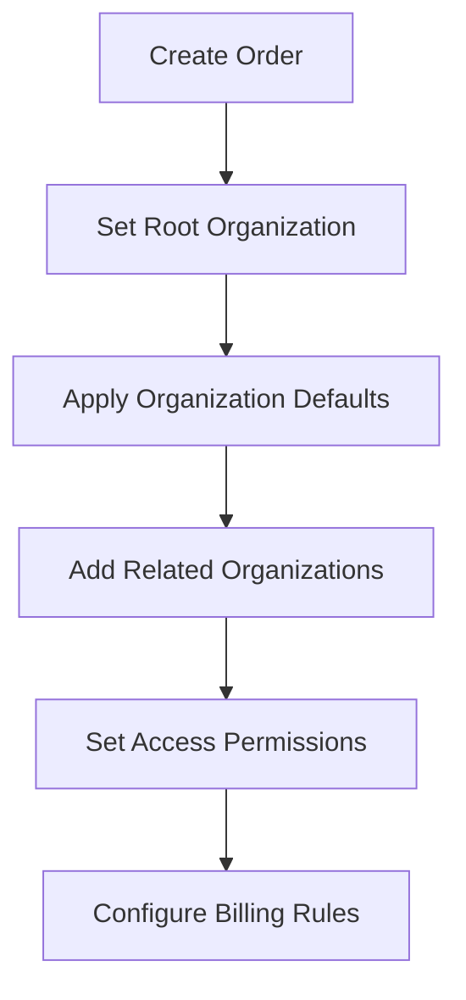

# ChargeCars V2 - Permission System & Financial Routing Design
**Created**: June 3, 2025  
**Status**: Proposed Design  
**Impact**: High - Core system architecture

---

## 🎯 **DESIGN OVERVIEW**

### Core Concepts:
1. **Root Organization**: Determines order configuration, workflows, and default routing
2. **Related Organizations**: Additional stakeholders (dealers, partners, conglomerates)
3. **Financial Routing**: Line items can be assigned to different organizations/contacts
4. **Split Billing**: Multiple invoices per order based on line item assignments
5. **Multi-Party Approval**: Quotes require approval from different stakeholders

---

## 📊 **DATABASE SCHEMA CHANGES**

### 1. **Order Table Enhancements**
Add fields for permission hierarchy and related organizations:

```sql
ALTER TABLE order ADD COLUMNS:
- root_organization_id (uuid, required, FK → organization)
  -- Organization that controls workflows and configuration
  
- related_organizations (json)
  -- Array of related organization objects:
  -- [{
  --   organization_id: uuid,
  --   relationship_type: 'dealer' | 'partner' | 'conglomerate' | 'subcontractor',
  --   permissions: ['view_order', 'edit_quote', 'approve_items'],
  --   visibility_scope: 'full' | 'limited' | 'financial_only',
  --   added_at: timestamp,
  --   added_by_contact_id: uuid
  -- }]

- default_billing_target (enum: 'customer' | 'root' | 'dealer' | 'split')
  -- Where line items are billed by default
  
- billing_configuration (json)
  -- Detailed billing rules and overrides
  -- {
  --   split_billing_enabled: boolean,
  --   auto_assign_rules: [...],
  --   invoice_grouping: 'by_organization' | 'by_contact' | 'single'
  -- }

- permission_configuration (json)
  -- Custom permission overrides for this order
  -- {
  --   require_customer_approval: boolean,
  --   require_dealer_approval: boolean,
  --   approval_thresholds: {...}
  -- }
```

### 2. **Line Item Financial Assignment**
Enhance line_item table for flexible billing:

```sql
ALTER TABLE line_item ADD COLUMNS:
- billing_organization_id (uuid, FK → organization)
  -- Which organization gets billed for this item
  
- financial_contact_id (uuid, FK → contact)
  -- Financial contact responsible for this line item
  
- billing_split (json)
  -- For items split between multiple parties:
  -- [{
  --   organization_id: uuid,
  --   contact_id: uuid,
  --   percentage: decimal,
  --   amount: decimal
  -- }]

- requires_approval_from (json)
  -- Array of contacts/orgs that must approve:
  -- [{
  --   type: 'contact' | 'organization',
  --   id: uuid,
  --   approved: boolean,
  --   approved_at: timestamp
  -- }]

- billing_notes (text)
  -- Special billing instructions for this item
```

### 3. **Organization Enhancements**
Already has financial_contact_id, but add:

```sql
ALTER TABLE organization ADD COLUMNS:
- default_billing_configuration (json)
  -- Organization's default billing preferences:
  -- {
  --   auto_approve_threshold: decimal,
  --   require_po_number: boolean,
  --   consolidated_invoicing: boolean,
  --   invoice_frequency: 'immediate' | 'weekly' | 'monthly'
  -- }

- permission_presets (json)
  -- Default permissions when added to orders:
  -- {
  --   can_view_financials: boolean,
  --   can_approve_quotes: boolean,
  --   can_modify_items: boolean,
  --   visibility_scope: 'full' | 'limited'
  -- }
```

### 4. **New Table: order_access_control**
Granular permissions per user/organization:

```sql
CREATE TABLE order_access_control (
  id uuid PRIMARY KEY,
  order_id uuid NOT NULL REFERENCES order(id),
  
  -- Who has access (one of these)
  contact_id uuid REFERENCES contact(id),
  organization_id uuid REFERENCES organization(id),
  
  -- Access level
  access_level enum('owner', 'editor', 'approver', 'viewer', 'financial_only'),
  
  -- Specific permissions
  permissions json,
  -- {
  --   can_view_order: boolean,
  --   can_edit_order: boolean,
  --   can_view_financials: boolean,
  --   can_approve_quote: boolean,
  --   can_modify_line_items: boolean,
  --   can_view_communications: boolean,
  --   can_add_participants: boolean,
  --   visible_line_items: 'all' | 'own' | uuid[],
  --   visible_fields: string[]
  -- }
  
  -- Metadata
  granted_by_contact_id uuid REFERENCES contact(id),
  granted_at timestamp DEFAULT NOW(),
  expires_at timestamp,
  is_active boolean DEFAULT true,
  
  created_at timestamp DEFAULT NOW(),
  updated_at timestamp DEFAULT NOW()
);

CREATE UNIQUE INDEX idx_order_access_unique 
  ON order_access_control(order_id, COALESCE(contact_id, '00000000-0000-0000-0000-000000000000'), 
                         COALESCE(organization_id, '00000000-0000-0000-0000-000000000000'));
```

### 5. **New Table: quote_approval_workflow**
Track multi-party quote approvals:

```sql
CREATE TABLE quote_approval_workflow (
  id uuid PRIMARY KEY,
  quote_id uuid NOT NULL REFERENCES quote(id),
  order_id uuid NOT NULL REFERENCES order(id),
  
  -- Approval configuration
  approval_type enum('sequential', 'parallel', 'threshold'),
  approval_threshold decimal, -- For threshold-based approvals
  
  -- Approval steps
  approval_steps json,
  -- [{
  --   step_number: integer,
  --   approver_type: 'contact' | 'organization' | 'role',
  --   approver_id: uuid,
  --   approver_role: string, -- e.g., 'financial_contact'
  --   required: boolean,
  --   status: 'pending' | 'approved' | 'rejected' | 'skipped',
  --   decided_at: timestamp,
  --   comments: string
  -- }]
  
  -- Current state
  current_step integer DEFAULT 1,
  overall_status enum('draft', 'pending_approval', 'partially_approved', 'approved', 'rejected'),
  
  -- Line item specific approvals
  line_item_approvals json,
  -- {
  --   [line_item_id]: {
  --     required_approvers: uuid[],
  --     approvals: {...}
  --   }
  -- }
  
  created_at timestamp DEFAULT NOW(),
  updated_at timestamp DEFAULT NOW()
);
```

### 6. **New Table: organization_billing_rules**
Define complex billing relationships:

```sql
CREATE TABLE organization_billing_rules (
  id uuid PRIMARY KEY,
  
  -- Rule applies to:
  from_organization_id uuid REFERENCES organization(id),
  to_organization_id uuid REFERENCES organization(id),
  relationship_type text, -- 'dealer_to_manufacturer', 'subsidiary_to_parent'
  
  -- Billing rules
  commission_rate decimal,
  markup_percentage decimal,
  
  -- Item routing rules
  item_routing_rules json,
  -- {
  --   default_billing_target: 'from' | 'to' | 'split',
  --   category_rules: {
  --     'installation': { target: 'from', commission: 0.15 },
  --     'hardware': { target: 'to', markup: 0.10 }
  --   }
  -- }
  
  -- Approval requirements
  approval_requirements json,
  -- {
  --   threshold_amount: decimal,
  --   require_both_approval: boolean,
  --   auto_approve_below: decimal
  -- }
  
  is_active boolean DEFAULT true,
  valid_from date,
  valid_until date,
  
  created_at timestamp DEFAULT NOW(),
  updated_at timestamp DEFAULT NOW()
);
```

---

## 🔄 **WORKFLOW IMPLEMENTATION**

### 1. **Order Creation Flow**


### 2. **Line Item Assignment Logic**
```javascript
// Pseudo-code for line item financial assignment
function assignLineItemBilling(lineItem, order) {
  // 1. Check explicit assignment
  if (lineItem.billing_organization_id) {
    return lineItem.billing_organization_id;
  }
  
  // 2. Check category rules
  const rules = getBillingRules(order.root_organization_id);
  const categoryRule = rules.category_rules[lineItem.category];
  if (categoryRule) {
    return applyRule(categoryRule, order);
  }
  
  // 3. Apply default billing target
  switch(order.default_billing_target) {
    case 'customer':
      return order.customer_organization_id;
    case 'root':
      return order.root_organization_id;
    case 'dealer':
      return order.related_organizations.find(o => o.relationship_type === 'dealer')?.organization_id;
    case 'split':
      return calculateSplitBilling(lineItem, order);
  }
}
```

### 3. **Permission Check Logic**
```javascript
// Pseudo-code for permission checking
function canUserAccessOrder(userId, orderId, requiredPermission) {
  // 1. Get user's organizations
  const userOrgs = getUserOrganizations(userId);
  
  // 2. Check direct access
  const directAccess = db.query(`
    SELECT * FROM order_access_control 
    WHERE order_id = ? AND contact_id = ? AND is_active = true
  `, [orderId, userId]);
  
  if (directAccess && hasPermission(directAccess.permissions, requiredPermission)) {
    return true;
  }
  
  // 3. Check organization-based access
  for (const org of userOrgs) {
    const orgAccess = db.query(`
      SELECT * FROM order_access_control 
      WHERE order_id = ? AND organization_id = ? AND is_active = true
    `, [orderId, org.id]);
    
    if (orgAccess && hasPermission(orgAccess.permissions, requiredPermission)) {
      return true;
    }
  }
  
  // 4. Check if user is from root organization (full access)
  const order = getOrder(orderId);
  if (userOrgs.some(org => org.id === order.root_organization_id)) {
    return true;
  }
  
  return false;
}
```

---

## 🔧 **API ENDPOINTS NEEDED**

### 1. **Permission Management**
- `POST /orders/{order_id}/access` - Grant access to user/organization
- `PUT /orders/{order_id}/access/{access_id}` - Update permissions
- `DELETE /orders/{order_id}/access/{access_id}` - Revoke access
- `GET /orders/{order_id}/access` - List all access rules

### 2. **Financial Assignment**
- `PUT /line-items/{id}/billing` - Update billing assignment
- `POST /line-items/bulk-assign` - Bulk assign billing
- `GET /orders/{id}/billing-summary` - Get billing breakdown

### 3. **Approval Workflow**
- `POST /quotes/{id}/submit-for-approval` - Start approval process
- `POST /quotes/{id}/approve` - Approve quote (with context)
- `POST /quotes/{id}/reject` - Reject quote with reason
- `GET /quotes/{id}/approval-status` - Get approval workflow status

---

## 🎯 **BENEFITS OF THIS DESIGN**

1. **Flexibility**: Supports any organization structure (dealers, conglomerates, partnerships)
2. **Granular Control**: Fine-grained permissions at order and line-item level
3. **Split Billing**: Native support for complex billing scenarios
4. **Audit Trail**: Complete tracking of who approved what and when
5. **Scalability**: Can handle complex multi-party transactions
6. **Backwards Compatible**: Existing simple orders still work

---

## 📋 **IMPLEMENTATION CHECKLIST**

- [ ] Update order table schema
- [ ] Update line_item table schema
- [ ] Update organization table schema
- [ ] Create order_access_control table
- [ ] Create quote_approval_workflow table
- [ ] Create organization_billing_rules table
- [ ] Implement permission checking functions
- [ ] Create billing assignment logic
- [ ] Build approval workflow engine
- [ ] Update existing APIs for permission checks
- [ ] Create new permission management APIs
- [ ] Add UI components for access management
- [ ] Test with various organization structures
- [ ] Document permission model for users

---

## 🚨 **MIGRATION CONSIDERATIONS**

1. **Existing Orders**: Set root_organization_id = customer_organization_id
2. **Permissions**: Grant full access to existing customer contacts
3. **Line Items**: Set billing_organization_id = order.customer_organization_id
4. **Backwards Compatibility**: Maintain existing behavior for simple orders 