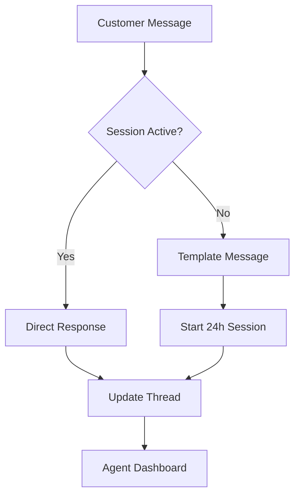

# ChargeCars V2 - Communication Workflow

**Laatste Update:** 15 juni 2025  
**Status:** Geïmplementeerd  
**Eigenaar:** Customer Success Team

## 📱 Multi-Channel Communication Overview

ChargeCars ondersteunt communicatie via meerdere kanalen per business entity:

- **Email** - Primary channel voor formele communicatie
- **SMS** - Afspraak reminders en urgente updates
- **WhatsApp** - Customer support en real-time updates
- **Voice** - Escalatie en persoonlijke service
- **Partner Portals** - B2B status updates

## 🏢 Business Entity Communication Configuration

### Email Inboxes per Entity

| Business Entity | Support Email | Sales Email | Admin Email | Noreply Email |
|----------------|---------------|-------------|-------------|---------------|
| ChargeCars B.V. | support@chargecars.nl | verkoop@chargecars.nl | admin@chargecars.nl | noreply@chargecars.nl |
| LaderThuis.nl | support@laderthuis.nl | info@laderthuis.nl | admin@laderthuis.nl | noreply@laderthuis.nl |
| MeterKastThuis.nl | support@meterkastthuis.nl | info@meterkastthuis.nl | admin@meterkastthuis.nl | noreply@meterkastthuis.nl |
| ZaptecShop.nl | support@zaptecshop.nl | bestellen@zaptecshop.nl | admin@zaptecshop.nl | noreply@zaptecshop.nl |
| RatioShop.nl | support@ratioshop.nl | verkoop@ratioshop.nl | admin@ratioshop.nl | noreply@ratioshop.nl |

### WhatsApp Business Accounts

| Business Entity | WhatsApp Number | Use Case |
|----------------|-----------------|----------|
| ChargeCars | +31 6 12345678 | General support |
| LaderThuis | +31 6 12345679 | Installation support |
| ZaptecShop | +31 6 12345680 | Product support |

## 📧 Email Communication Templates

### Template Categories

1. **Order Status Updates**
   - New order confirmation
   - Quote ready notification
   - Installation scheduled
   - Completion confirmation
   - On hold notification

2. **Customer Engagement**
   - Welcome emails
   - Survey invitations
   - Product information
   - Maintenance reminders

3. **Partner Communications**
   - Order notifications
   - Status updates
   - Commission statements
   - Performance reports

### Template Structure

```handlebars
Subject: {{subject_template}}

Beste {{customer_name}},

{{opening_line}}

**Order Details:**
- Order nummer: {{order_number}}
- Status: {{order_status_friendly}}
- Business: {{business_entity_name}}

{{body_content}}

{{action_buttons}}

Met vriendelijke groet,
{{sender_name}}
{{business_entity_name}}

{{footer_links}}
{{unsubscribe_link}}
```

## 🔄 Communication Triggers & Automation

### Status-Based Triggers

```yaml
status_triggers:
  new_order:
    channels: [email]
    template: order_confirmation
    delay: immediate
    
  quote_sent:
    channels: [email, sms]
    template: quote_notification
    delay: immediate
    follow_up: 3_days
    
  scheduled:
    channels: [email, sms, whatsapp]
    template: appointment_confirmation
    delay: immediate
    reminder: 1_day_before
    
  completed:
    channels: [email]
    template: completion_thank_you
    delay: immediate
    survey: 7_days
    
  on_hold:
    channels: [email, sms]
    template: hold_notification
    delay: immediate
    follow_up: weekly
```

### Time-Based Triggers

1. **Appointment Reminders**
   - T-48h: Email reminder
   - T-24h: SMS reminder
   - T-2h: WhatsApp reminder

2. **Follow-ups**
   - Quote sent +3d: Follow-up email
   - Quote sent +7d: Call trigger
   - Completed +7d: Satisfaction survey
   - Completed +365d: Annual check-up

3. **Escalations**
   - SLA breach: Manager notification
   - No response 14d: Escalation email
   - Payment overdue: Collection process

## 💬 WhatsApp Business Integration

### Message Types

1. **Template Messages** (Pre-approved)
   - Order confirmations
   - Appointment reminders
   - Status updates
   - Payment reminders

2. **Session Messages** (24-hour window)
   - Customer support
   - Real-time updates
   - Q&A responses
   - Document sharing

### WhatsApp Flow



## 📱 SMS Communication

### SMS Use Cases

1. **Transactional**
   - Appointment confirmations
   - Installation reminders
   - Urgent updates
   - Two-factor authentication

2. **Marketing** (With consent)
   - Promotional offers
   - Product launches
   - Event invitations
   - Service reminders

### SMS Templates

```
ChargeCars: Uw installatie is gepland op {{date}} om {{time}}. 
Team: {{installer_team}}. 
Wijzigen? Bel 020-1234567
```

## 🧵 Communication Thread Management

### Thread Structure

```json
{
  "thread_id": "uuid",
  "entity_type": "order",
  "entity_id": "order_uuid",
  "subject": "Order CC-2025-00123 Communication",
  "participants": [
    {
      "contact_id": "uuid",
      "role": "customer",
      "channels": ["email", "sms", "whatsapp"]
    }
  ],
  "messages": [
    {
      "message_id": "uuid",
      "channel": "email",
      "direction": "outbound",
      "timestamp": "2025-06-15T10:00:00Z",
      "subject": "Order Confirmation",
      "content": "...",
      "status": "delivered",
      "opened_at": "2025-06-15T10:05:00Z"
    }
  ]
}
```

### Thread Lifecycle

1. **Creation**
   - Auto-created on first communication
   - Linked to business entity
   - Tagged with context

2. **Management**
   - All channels in one thread
   - Chronological message history
   - Agent assignment
   - Priority handling

3. **Resolution**
   - Auto-close after completion
   - Archive after 90 days
   - Searchable history
   - Compliance retention

## 📊 Communication Analytics

### Key Metrics

1. **Channel Performance**
   - Open rates by channel
   - Response rates
   - Delivery success
   - Channel preference

2. **Template Performance**
   - Click-through rates
   - Conversion impact
   - A/B test results
   - Language preferences

3. **Agent Performance**
   - Response times
   - Resolution rates
   - Customer satisfaction
   - Channel efficiency

### Dashboard Views

```sql
-- Daily Communication Summary
SELECT 
  channel,
  COUNT(*) as messages_sent,
  AVG(CASE WHEN opened_at IS NOT NULL THEN 1 ELSE 0 END) as open_rate,
  AVG(EXTRACT(EPOCH FROM (first_response - sent_at))/3600) as avg_response_hours
FROM communication_messages
WHERE DATE(created_at) = CURRENT_DATE
GROUP BY channel;
```

## 🚨 Escalation & Priority Handling

### Priority Matrix

| Priority | Response Time | Channels | Escalation |
|----------|--------------|----------|------------|
| Urgent | < 1 hour | All | Manager |
| High | < 4 hours | Email, WhatsApp | Team Lead |
| Normal | < 24 hours | Email | Agent |
| Low | < 48 hours | Email | Agent |

### Escalation Triggers

1. **No Response**
   - Customer: 48h → SMS reminder
   - Customer: 72h → Call trigger
   - Partner: 24h → Escalation email

2. **Negative Sentiment**
   - AI sentiment < -0.5 → Priority boost
   - Keywords: "complaint", "problem" → Alert
   - Multiple attempts → Manager review

3. **VIP Handling**
   - Partner orders → High priority
   - Large orders → Dedicated agent
   - Repeat customers → Preferred channel

## 🔐 Compliance & Privacy

### GDPR Compliance

1. **Consent Management**
   - Explicit consent for marketing
   - Channel preferences
   - Unsubscribe handling
   - Data retention policies

2. **Data Security**
   - Encryption in transit
   - Secure storage
   - Access logging
   - PII masking

### Communication Policies

1. **Business Hours**
   - Email: 24/7 sending
   - SMS: 8:00-20:00 only
   - WhatsApp: 8:00-22:00
   - Calls: 9:00-17:00

2. **Frequency Limits**
   - Max 3 emails/week (non-transactional)
   - Max 2 SMS/week
   - No duplicate messages < 24h

## 🛠️ Integration Architecture

### Communication Providers

1. **Email**: SendGrid
   - Transactional API
   - Marketing campaigns
   - Analytics webhook
   - Bounce handling

2. **SMS**: MessageBird
   - Global coverage
   - Delivery reports
   - Two-way messaging
   - Number validation

3. **WhatsApp**: WhatsApp Business API
   - Official provider
   - Template management
   - Media support
   - Session handling

### Make.com Automations

- **Email parsing**: 4,848 operations/month
- **Auto-responses**: 1,363 operations/month
- **Channel routing**: 2,500 operations/month
- **Template rendering**: 3,200 operations/month

---

**Gerelateerde Documenten:**
- [Communication Template Library](../templates/communication-templates.md)
- [Channel Configuration Guide](../technical-specs/channel-setup.md)
- [Privacy & GDPR Policy](../legal/privacy-policy.md)
- [Customer Support Playbook](customer-support-workflow.md) 