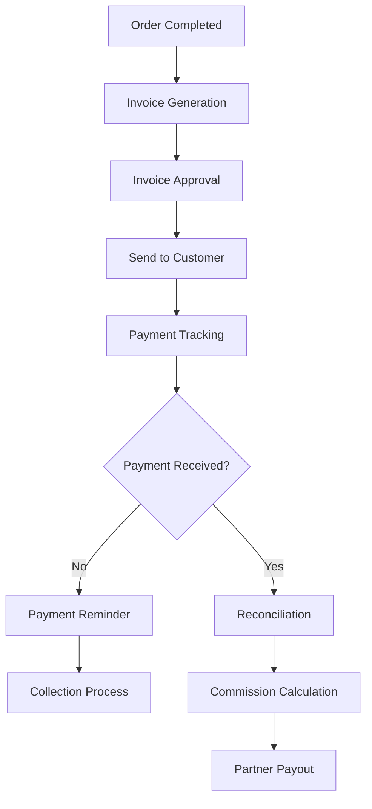

# ChargeCars V2 - Financial Workflow

**Laatste Update:** 15 juni 2025  
**Status:** In Ontwikkeling  
**Eigenaar:** Finance Team  
**Prioriteit:** 🔥 HOOG - Kritiek voor business operations

## 💰 Financial Process Overview

Het financiële proces omvat facturatie, betalingsverwerking, commissie berekeningen en financiële rapportage voor alle 5 business entities.



## 🏢 Multi-Entity Financial Structure

### Business Entity Configuration

| Entity | BTW Number | Bank Account | Invoice Prefix | Payment Terms |
|--------|------------|--------------|----------------|---------------|
| ChargeCars B.V. | NL123456789B01 | NL12RABO0123456789 | CC-INV | 14 dagen |
| LaderThuis.nl B.V. | NL987654321B02 | NL34RABO0987654321 | LT-INV | 14 dagen |
| MeterKastThuis.nl B.V. | NL456789123B03 | NL56RABO0456789123 | MK-INV | 14 dagen |
| ZaptecShop.nl B.V. | NL789123456B04 | NL78RABO0789123456 | ZS-INV | 30 dagen |
| RatioShop.nl B.V. | NL321654987B05 | NL90RABO0321654987 | RS-INV | 30 dagen |

## 📄 Invoice Generation Process

### 1. Trigger Conditions

**Automatic Generation:**
- Order status = `completed`
- Sign-off received
- All line items delivered

**Manual Generation:**
- Partial delivery
- Prepayment required
- Custom billing arrangement

### 2. Invoice Number Generation

```javascript
// Format: {ENTITY_PREFIX}-{YEAR}-{SEQUENCE}
// Example: CC-INV-2025-00123

function generateInvoiceNumber(business_entity, year) {
  const prefix = ENTITY_CONFIG[business_entity].invoice_prefix;
  const sequence = getNextSequence(business_entity, 'invoice', year);
  return `${prefix}-${year}-${sequence.padStart(5, '0')}`;
}
```

### 3. Invoice Components

```yaml
invoice_structure:
  header:
    - invoice_number
    - invoice_date
    - due_date
    - business_entity_details
    - customer_details
    
  line_items:
    - product_description
    - quantity
    - unit_price
    - tax_rate (21% or 9%)
    - line_total
    
  totals:
    - subtotal_excl_tax
    - tax_amounts_per_rate
    - total_incl_tax
    - already_paid
    - amount_due
    
  footer:
    - payment_instructions
    - terms_conditions
    - contact_information
```

## 💳 Payment Processing

### Payment Methods Accepted

1. **Bank Transfer (SEPA)**
   - Most common method
   - 14-30 day payment terms
   - Automatic reconciliation via bank API

2. **iDEAL**
   - Instant payment
   - Direct status update
   - Lower transaction fees

3. **Credit Card (Stripe)**
   - For webshop orders
   - Immediate processing
   - Higher transaction fees

4. **Direct Debit**
   - For recurring customers
   - Pre-authorized payments
   - SEPA mandate required

### Payment Reconciliation Process

```sql
-- Daily reconciliation query
SELECT 
  i.invoice_number,
  i.total_amount,
  COALESCE(SUM(p.amount), 0) as paid_amount,
  i.total_amount - COALESCE(SUM(p.amount), 0) as outstanding,
  CASE 
    WHEN i.total_amount <= COALESCE(SUM(p.amount), 0) THEN 'paid'
    WHEN i.due_date < CURRENT_DATE THEN 'overdue'
    ELSE 'pending'
  END as payment_status
FROM invoices i
LEFT JOIN payments p ON i.id = p.invoice_id
WHERE i.status != 'cancelled'
GROUP BY i.id, i.invoice_number, i.total_amount, i.due_date;
```

## 🤝 Partner Commission Calculation

### Commission Structure

| Partner Type | Commission Rate | Payment Schedule |
|--------------|----------------|------------------|
| Automotive Partner | 5-10% | Monthly |
| Energy Provider | 8-12% | Monthly |
| Installation Partner | Fixed fee | Per order |
| Referral Partner | 3-5% | Quarterly |

### Commission Calculation Rules

```javascript
function calculatePartnerCommission(order) {
  const partner = getPartner(order.partner_id);
  const commission_config = partner.commission_structure;
  
  let commission = 0;
  
  if (commission_config.type === 'percentage') {
    // Percentage of order value
    commission = order.total_amount * (commission_config.rate / 100);
  } else if (commission_config.type === 'fixed') {
    // Fixed amount per order
    commission = commission_config.amount;
  } else if (commission_config.type === 'tiered') {
    // Tiered based on volume
    const tier = getTierForVolume(partner.monthly_orders);
    commission = order.total_amount * (tier.rate / 100);
  }
  
  // Apply caps if configured
  if (commission_config.max_per_order) {
    commission = Math.min(commission, commission_config.max_per_order);
  }
  
  return commission;
}
```

## 📊 Financial Reporting

### Daily Reports

1. **Cash Position**
   - Payments received today
   - Outstanding invoices
   - Overdue amounts
   - Expected payments this week

2. **Sales Performance**
   - Orders completed
   - Invoices generated
   - Average order value
   - Entity breakdown

### Monthly Reports

1. **P&L per Entity**
   - Revenue recognition
   - Cost of goods sold
   - Operating expenses
   - Net profit

2. **Partner Commissions**
   - Commission accruals
   - Payments due
   - YTD partner performance

3. **Aging Analysis**
   - 0-30 days
   - 31-60 days
   - 61-90 days
   - >90 days

## 🚨 Payment Collection Process

### Automated Reminders

```yaml
payment_reminders:
  first_reminder:
    trigger: due_date + 3 days
    channel: email
    template: friendly_reminder
    
  second_reminder:
    trigger: due_date + 10 days
    channel: email + sms
    template: urgent_reminder
    
  final_notice:
    trigger: due_date + 21 days
    channel: email + phone
    template: final_notice
    action: flag_for_collection
```

### Collection Escalation

1. **Level 1: Automated** (0-30 days overdue)
   - Email reminders
   - SMS notifications
   - Payment plan offer

2. **Level 2: Personal Contact** (31-60 days overdue)
   - Phone calls
   - Payment arrangement
   - Partial payment acceptance

3. **Level 3: Collection Agency** (>60 days overdue)
   - Transfer to collection agency
   - Legal proceedings if needed
   - Write-off consideration

## 🔄 Integration Points

### Accounting Software Integration

**Exact Online Export:**
```xml
<invoice>
  <administration>ChargeCars B.V.</administration>
  <invoice_number>CC-INV-2025-00123</invoice_number>
  <customer_code>CUS-12345</customer_code>
  <invoice_date>2025-06-15</invoice_date>
  <line_items>
    <item>
      <ledger_account>8000</ledger_account>
      <amount_excl_tax>1500.00</amount_excl_tax>
      <tax_code>BTW21</tax_code>
    </item>
  </line_items>
</invoice>
```

### Bank Integration

- **Rabobank API**: Daily transaction import
- **Matching Rules**: IBAN + amount + reference
- **Auto-reconciliation**: 85% success rate

### Payment Provider Integration

- **Stripe**: Webhook for instant updates
- **Mollie**: iDEAL and credit card processing
- **SEPA**: Batch processing for direct debits

## 📈 KPIs and Metrics

### Financial Health Indicators

| Metric | Target | Current | Status |
|--------|--------|---------|--------|
| DSO (Days Sales Outstanding) | <21 days | 18 days | ✅ |
| Collection Rate | >98% | 97.5% | ⚠️ |
| Invoice Accuracy | >99.5% | 99.8% | ✅ |
| Payment Processing Time | <2 hours | 1.5 hours | ✅ |
| Partner Payment Accuracy | 100% | 100% | ✅ |

### Revenue Analytics

```sql
-- Monthly revenue trend
SELECT 
  DATE_TRUNC('month', invoice_date) as month,
  business_entity,
  SUM(total_amount) as revenue,
  COUNT(*) as invoice_count,
  AVG(total_amount) as avg_invoice_value
FROM invoices
WHERE status = 'paid'
GROUP BY month, business_entity
ORDER BY month DESC;
```

## 🔐 Compliance & Audit

### Tax Compliance

1. **BTW Aangifte** (Monthly)
   - Automated calculation
   - Review process
   - Submission tracking

2. **Factuurvereisten**
   - Sequential numbering ✅
   - Complete company details ✅
   - Tax breakdown ✅
   - Retention period: 7 years

### Audit Trail

```yaml
financial_audit_requirements:
  - Every transaction logged
  - User actions tracked
  - Document versioning
  - Approval workflows
  - Change justifications
  - Regular backups
```

## 🛠️ Financial System Architecture

### Database Schema (To Be Implemented)

```sql
-- INVOICES table
CREATE TABLE invoices (
  id UUID PRIMARY KEY,
  invoice_number VARCHAR UNIQUE NOT NULL,
  order_id UUID REFERENCES orders(id),
  business_entity VARCHAR NOT NULL,
  invoice_date DATE NOT NULL,
  due_date DATE NOT NULL,
  status ENUM('draft','sent','paid','partial','overdue','cancelled'),
  subtotal_excl_tax DECIMAL(10,2),
  tax_amount DECIMAL(10,2),
  total_incl_tax DECIMAL(10,2),
  paid_amount DECIMAL(10,2) DEFAULT 0,
  created_at TIMESTAMP DEFAULT NOW()
);

-- PAYMENTS table
CREATE TABLE payments (
  id UUID PRIMARY KEY,
  invoice_id UUID REFERENCES invoices(id),
  payment_date DATE NOT NULL,
  amount DECIMAL(10,2) NOT NULL,
  payment_method VARCHAR NOT NULL,
  reference VARCHAR,
  bank_transaction_id VARCHAR,
  status ENUM('pending','completed','failed','refunded'),
  created_at TIMESTAMP DEFAULT NOW()
);

-- PARTNER_COMMISSIONS enhanced
ALTER TABLE partner_commissions ADD COLUMN (
  calculation_date DATE,
  approval_status ENUM('pending','approved','rejected'),
  approved_by UUID REFERENCES user_accounts(id),
  payment_batch_id VARCHAR,
  notes TEXT
);
```

## 🚀 Implementation Priorities

### Phase 1: Core Financial (Week 1-2) 🔥
1. Create invoices table
2. Create payments table
3. Invoice generation API
4. Basic payment tracking

### Phase 2: Automation (Week 3-4)
1. Automated reminders
2. Bank reconciliation
3. Commission calculation
4. Partner statements

### Phase 3: Integration (Week 5-6)
1. Accounting software export
2. Payment provider webhooks
3. Bank API connection
4. Reporting dashboards

---

**Gerelateerde Documenten:**
- [Invoice API Specification](../api-docs/financial-api.md)
- [Tax Compliance Guide](../legal/tax-compliance.md)
- [Partner Commission Policy](partner-commission-policy.md)
- [Collection Procedures](collection-procedures.md) 