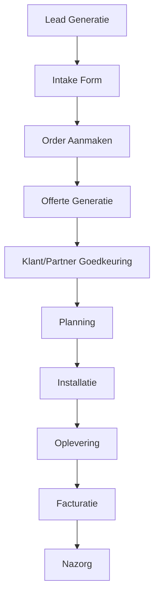

# ChargeCars V2 - Order Lifecycle Workflow

**Laatste Update:** 15 juni 2025  
**Status:** Geïmplementeerd  
**Eigenaar:** Operations Team

## 📋 Workflow Overzicht

De order lifecycle workflow beschrijft het complete proces vanaf lead generatie tot en met afronding van de installatie en facturatie.



## 🔄 Workflow Stappen

### 1. Lead Generatie
**Triggers:**
- Partner API integratie (Groendus, Essent, 50five)
- Website intake formulier
- HubSpot CRM import
- Direct sales

**Acties:**
- Contact record aanmaken/updaten (person of organization)
- Parent organization linken indien van toepassing
- Channel hierarchy bepalen
- Address validatie via PostcodeAPI/Google
- Partner referenties opslaan in channel_contact_ids
- Initial status: `new_lead`

**Contact Hierarchy:**
- Bij partner lead: account_contact_id = partner, end_customer_contact_id = klant
- Bij direct sales: account_contact_id = end_customer_contact_id = klant
- Channel partners toevoegen aan channel_contact_ids array

**Automatisering:**
- Make.com: "Groendus > ChargeCars klant + order + intake" (3,254 ops)
- Make.com: "HubSpot contacts > SmartSuite" (8,203 ops)

### 2. Intake Formulier
**Triggers:**
- Lead status = `new_lead`
- Manual trigger door sales

**Acties:**
- Intake form URL genereren
- Email/SMS versturen naar klant
- Form submission tracking
- Status update: `intake_sent`

**Automatisering:**
- Make.com: "Intakeformulier versturen" (1,363 ops)
- Template: "Intake Form Invitation"

### 3. Order Aanmaken
**Triggers:**
- Intake form completed
- Partner order received
- Manual order creation

**Acties:**
- Order number genereren (per business entity)
- Line items toevoegen
- Installation address valideren
- Status: `intake_completed`

**Business Rules:**
- Order nummer format: `{ENTITY_PREFIX}-{YEAR}-{SEQUENCE}`
- Sequence per business entity per jaar
- Address validation required

### 4. Offerte Generatie
**Triggers:**
- Order status = `intake_completed`
- All required data present

**Acties:**
- Calculate pricing based on:
  - Products/services
  - Installation complexity
  - Partner margins
- Generate quote PDF
- Status: `quote_draft` → `quote_ready` → `quote_sent`

**Automatisering:**
- Make.com: "2.0 leadgen offerte generation" (972 ops)
- Template engine voor PDF generatie

### 5. Goedkeuring Proces
**Triggers:**
- Quote sent to customer/partner
- Response received

**Acties:**
- Track approval status
- Handle revisions
- Capture signatures
- Status progression:
  - `customer_approved`
  - `partner_approved`
  - `both_approved`

**SLA:**
- Customer response: 7 dagen
- Partner response: 24 uur
- Escalatie na SLA breach

### 6. Planning & Scheduling
**Triggers:**
- Order status = `both_approved`
- Resources available

**Acties:**
- Check installer availability
- Route optimization
- Customer communication
- Status: `planning` → `scheduled`

**Integraties:**
- Team planning system
- Google Maps voor route planning
- Calendar synchronisatie

### 7. Installatie Uitvoering
**Triggers:**
- Scheduled date reached
- Installer check-in

**Acties:**
- Work order generatie
- Real-time status updates
- Photo/document capture
- Material tracking
- Status: `in_progress`

**Tools:**
- Mobile app voor installers
- Make.com: "Clickup generate werkbon URL" (2,816 ops)
- GPS tracking

### 8. Oplevering & Sign-off
**Triggers:**
- Installation completed
- Quality checks passed

**Acties:**
- Digital sign-off capture
- Installation photos
- Compliance documentation
- Status: `completed`

**Validaties:**
- Customer signature required
- Photo evidence required
- Technical checklist completed

### 9. Facturatie
**Triggers:**
- Order status = `completed`
- Sign-off received

**Acties:**
- Invoice generation
- Payment tracking
- Partner commission calculation
- Status tracking in financial system

**Business Rules:**
- Invoice binnen 48 uur na oplevering
- Partner commissie volgens contract
- Multi-entity facturatie support

### 10. Nazorg & Support
**Triggers:**
- Post-installation period
- Customer inquiries
- Warranty claims

**Acties:**
- Customer satisfaction survey
- Support ticket handling
- Warranty administration
- Upsell opportunities

## 🚦 Status Workflow Engine

### Status Transitie Regels

```yaml
order_statuses:
  new_lead:
    next: [intake_sent, cancelled]
    sla_hours: 24
    
  intake_sent:
    next: [intake_completed, cancelled]
    sla_hours: 168
    
  intake_completed:
    next: [quote_draft, on_hold]
    sla_hours: 24
    
  quote_draft:
    next: [quote_ready, on_hold]
    sla_hours: 48
    
  quote_ready:
    next: [quote_sent, on_hold]
    sla_hours: 2
    
  quote_sent:
    next: [customer_approved, cancelled, on_hold]
    sla_hours: 168
    
  customer_approved:
    next: [partner_approved, both_approved, on_hold]
    sla_hours: 24
    
  partner_approved:
    next: [both_approved, on_hold]
    sla_hours: 24
    
  both_approved:
    next: [planning, on_hold]
    sla_hours: 48
    
  planning:
    next: [scheduled, on_hold]
    sla_hours: 72
    
  scheduled:
    next: [in_progress, on_hold]
    sla_hours: null
    
  in_progress:
    next: [completed, on_hold]
    sla_hours: null
    
  completed:
    next: []
    final: true
    
  cancelled:
    next: []
    final: true
    requires_reason: true
    
  on_hold:
    next: [all_previous_statuses]
    requires_reason: true
```

## 📊 KPI Monitoring

### Conversion Metrics
- Lead → Intake: Target 80%
- Intake → Quote: Target 90%
- Quote → Approved: Target 40%
- Approved → Completed: Target 95%

### SLA Performance
- Average response time per status
- Overdue percentage per phase
- Bottleneck identification

### Financial Metrics
- Average order value per entity
- Partner margin analysis
- Payment collection rate

## 🔧 Automatisering & Integraties

### Make.com Scenarios
1. **Lead Processing**: 8,203 operations/month
2. **Address Validation**: 12,449 operations/month
3. **Partner Integration**: 9,354 operations/month
4. **Document Generation**: 3,686 operations/month

### API Integraties
- PostcodeAPI voor adres validatie
- Google Maps voor geocoding
- Partner APIs (Groendus, Essent, 50five)
- Payment providers

### Communication Channels
- Email templates per status change
- SMS voor afspraak reminders
- WhatsApp voor customer support
- Partner portals voor status updates

## 🚨 Exception Handling

### On Hold Proces
- Categorieën: customer_delay, supplier_delay, technical_issue, etc.
- Escalatie na X dagen
- Automatische follow-up
- Hold resolution tracking

### Cancellation Proces
- Reason code required
- Refund calculation
- Partner notification
- Inventory adjustment

## 📝 Compliance & Audit

### Data Requirements
- Complete audit trail via status_transitions
- Document retention policy
- GDPR compliance voor customer data
- Financial audit trail

### Reporting
- Daily operations dashboard
- Weekly management reports
- Monthly partner reports
- Quarterly business review data

## 🔄 Continuous Improvement

### Process Optimization
- Regular SLA review
- Automation opportunity identification
- Partner feedback integration
- Customer journey mapping

### System Enhancements
- AI-powered planning optimization
- Predictive maintenance scheduling
- Dynamic pricing models
- Real-time partner integration

---

**Gerelateerde Documenten:**
- [Status Engine API Specification](../api-docs/status-engine-api.md)
- [Partner Integration Guide](partner-integration-workflow.md)
- [Communication Templates](communication-workflow.md)
- [Financial Processing Workflow](financial-workflow.md) 