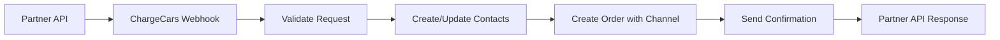

# ChargeCars V2 - Partner Integration Workflow

**Laatste Update:** 15 juni 2025  
**Status:** Actief  
**Eigenaar:** Partner Success Team

## 🤝 Partner Overzicht

ChargeCars werkt samen met verschillende partners voor lead generatie en order fulfillment:

- **Groendus** - Energie leverancier met laadpaal bundels
- **Essent** - Energie leverancier met installatie services  
- **50five** - Installatie partner
- **Eneco** - Energie leverancier
- **Alva** - Charging solutions provider

## 📊 Partner Integration Metrics

| Partner | Monthly Orders | Integration Type | Active Since |
|---------|---------------|------------------|--------------|
| Groendus | 250-300 | API + Portal | Jan 2024 |
| Essent | 150-200 | Webhook | Aug 2024 |
| 50five | 50-75 | Form/API | Mar 2024 |
| Eneco | 100-150 | API | Apr 2025 |
| Alva | 75-100 | Email Parse | Apr 2025 |

## 🔄 Integration Workflows

### 1. API Integration (Groendus, Eneco)



**Process Steps:**

1. **Receive Order Request**
   - Webhook endpoint: `/partners/{partner_id}/orders`
   - Authentication via API key
   - Request validation

2. **Contact Management (NEW STRUCTURE)**
   - Find or create partner contact (contact_type = 'organization')
   - Find or create end customer contact (person or organization)
   - Link contacts via parent_organization_id if needed
   - Store partner references

3. **Order Creation with Channel Support**
   - Generate ChargeCars order number
   - Set account_contact_id = partner contact
   - Set end_customer_contact_id = customer contact
   - Add partner to channel_contact_ids array
   - Map partner products to internal catalog
   - Store partner order ID in partner_metadata

4. **Response & Confirmation**
   - Return ChargeCars order number
   - Status: "received"
   - Estimated processing time

### 2. Form Integration (50five)

**Process:**
- Partner submits via custom form
- Make.com scenario processes submission
- Creates order in ChargeCars system
- Email confirmation to partner

### 3. Email Parsing (Alva)

**Process:**
- Orders arrive via email
- AI parsing extracts order details
- Manual validation if confidence < 90%
- Order creation after validation

## 📋 Partner Data Mapping

### Required Fields from Partners

```json
{
  "partner_order_id": "string (required)",
  "customer": {
    "name": "string (required)",
    "email": "string (required)",
    "phone": "string (required)",
    "address": {
      "street": "string",
      "house_number": "string",
      "postal_code": "string (required)",
      "city": "string"
    }
  },
  "products": [
    {
      "partner_sku": "string",
      "quantity": "number",
      "description": "string"
    }
  ],
  "installation_preferences": {
    "preferred_date": "date",
    "notes": "string"
  },
  "partner_references": {
    "dealer_group_id": "string",
    "purchase_order": "string",
    "customer_account": "string"
  }
}
```

### Product Mapping Table

| Partner | Partner SKU | ChargeCars Article | Type |
|---------|------------|-------------------|------|
| Groendus | GRO-ALFEN-11 | ALF-EVE-S-11KW | Wallbox |
| Groendus | GRO-INSTALL-1 | INST-BASIC-1P | Installation |
| Essent | ESS-WALLBOX-22 | ALF-EVE-D-22KW | Wallbox |
| 50five | 50F-ZAPPI-7 | MYE-ZAPPI-7KW | Wallbox |

## 🔐 Security & Authentication

### API Authentication Methods

1. **API Key Authentication**
   - Unique key per partner
   - Stored in `partner_integration` table
   - Rate limiting per key

2. **Webhook Signatures**
   - HMAC validation for webhooks
   - Timestamp validation (5 min window)
   - IP whitelist option

3. **OAuth 2.0** (Future)
   - For advanced integrations
   - Token refresh mechanism
   - Scope-based permissions

## 📊 Status Synchronization

### Outbound Status Updates

**Trigger Events:**
- Quote sent
- Customer approved
- Installation scheduled
- Installation completed
- Order cancelled/on hold

**Update Methods:**
1. **Webhook Callbacks**
   ```json
   POST {partner_webhook_url}
   {
     "event": "status_update",
     "order_id": "CC-2025-00123",
     "partner_order_id": "GRO-123456",
     "status": "scheduled",
     "scheduled_date": "2025-07-20",
     "installer": "Team Amsterdam Noord"
   }
   ```

2. **API Polling**
   - Partners can poll `/orders/{partner_order_id}/status`
   - Rate limited to 1 request/minute

3. **Email Notifications**
   - Automated emails for key milestones
   - Partner-specific templates

## 🚨 Error Handling

### Common Integration Issues

1. **Duplicate Orders**
   - Check by partner_order_id
   - Return existing order if duplicate
   - Log occurrence for monitoring

2. **Invalid Product Mapping**
   - Log unmapped products
   - Create order with note
   - Manual intervention required

3. **Address Validation Failures**
   - Store original address
   - Flag for manual review
   - Notify partner of issue

### Retry Logic

```yaml
retry_policy:
  max_attempts: 3
  initial_delay: 60 # seconds
  backoff_multiplier: 2
  max_delay: 3600 # 1 hour
  
failed_webhook_handling:
  store_failed_attempts: true
  alert_after_failures: 3
  fallback_to_email: true
```

## 📈 Partner Performance Metrics

### Key Metrics to Track

1. **Order Volume**
   - Daily/weekly/monthly orders per partner
   - Growth trends
   - Seasonal patterns

2. **Integration Health**
   - API response times
   - Error rates
   - Successful order percentage

3. **Business Metrics**
   - Average order value by partner
   - Conversion rates
   - Customer satisfaction by source

### SLA Commitments

| Metric | Target | Current |
|--------|--------|---------|
| API Uptime | 99.9% | 99.95% |
| Response Time | <500ms | 245ms avg |
| Order Processing | <5 min | 3.2 min avg |
| Status Update Delay | <1 min | 45 sec avg |

## 🏗️ Channel Hierarchy Management

### Partner Contact Structure

Partners worden nu gemodelleerd als contacts met channel hierarchie:

```
Master Partner (contact_type = 'organization')
├── Regional Partner (parent_organization_id = Master Partner)
│   ├── Local Dealer (parent_organization_id = Regional Partner)
│   │   └── Sales Agent (parent_organization_id = Local Dealer)
│   └── Another Dealer
└── Direct Channel Partner
```

### Channel Commission Distribution

Bij orders via multiple channels:
1. **Identificeer alle channel partners** via channel_contact_ids
2. **Bereken commissie per level** based op hierarchy position
3. **Create commission records** voor elke partner

Voorbeeld:
```json
{
  "order": {
    "account_contact_id": "master_partner_uuid",
    "end_customer_contact_id": "customer_uuid",
    "channel_contact_ids": [
      "master_partner_uuid",
      "regional_partner_uuid", 
      "local_dealer_uuid"
    ]
  },
  "commissions": [
    {
      "beneficiary_contact_id": "master_partner_uuid",
      "commission_level": 1,
      "commission_rate": 5.0
    },
    {
      "beneficiary_contact_id": "regional_partner_uuid",
      "commission_level": 2,
      "commission_rate": 3.0
    },
    {
      "beneficiary_contact_id": "local_dealer_uuid",
      "commission_level": 3,
      "commission_rate": 2.0
    }
  ]
}
```

## 🔄 Onboarding New Partners

### Technical Onboarding Steps

1. **Initial Setup**
   - Create partner contact (contact_type = 'organization')
   - Set parent_organization_id if part of channel
   - Generate API credentials
   - Configure integration type

2. **Product Mapping**
   - Map partner SKUs to ChargeCars articles
   - Define pricing rules
   - Set commission structure

3. **Integration Testing**
   - Sandbox environment access
   - Test order creation
   - Verify status updates
   - Load testing if needed

4. **Go-Live**
   - Production credentials
   - Monitoring setup
   - Support channel establishment

### Documentation Requirements

- API documentation (Swagger/OpenAPI)
- Integration guide with examples
- Error code reference
- Support contact information

## 🛠️ Make.com Automation Scenarios

### Active Partner Scenarios

1. **Groendus > ChargeCars klant + order + intake**
   - Operations: 3,254/month
   - Handles complete order flow
   - Includes address validation

2. **Alva charging email parsing**
   - Operations: 4,848/month
   - AI-powered email parsing
   - Manual validation fallback

3. **Eneco job creation from fillout**
   - Operations: 1,156/month
   - Form to order conversion
   - Customer notification

4. **50five input naar clickup**
   - Operations: 96/month
   - Legacy integration
   - Being migrated to new system

## 📝 Partner Agreement Requirements

### Technical Requirements
- Minimum order data fields
- API rate limits acceptance
- Data retention policies
- Security compliance

### Business Requirements
- Commission structure
- SLA agreements
- Cancellation policies
- Dispute resolution

### Legal Requirements
- Data processing agreement
- GDPR compliance
- Liability limitations
- Termination clauses

---

**Gerelateerde Documenten:**
- [Partner API Specification](../api-docs/partner-integration-api.md)
- [Order Lifecycle Workflow](order-lifecycle-workflow.md)
- [Security & Authentication Guide](../technical-specs/security-guide.md)
- [Partner Onboarding Checklist](partner-onboarding-checklist.md) 